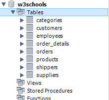

### Boas vindas ao Projeto Vocabulary Booster
---

# Neste projeto irei:

  * Criar condicionais no **SQL** usando **IF** e **CASE**

  * Manipular _strings_ no **SQL**

  * Usar as diversas funções matemáticas do **MySQL**

  * Extrair informações específicas sobre datas de uma tabela

  * Utilizar as funções de agregação **AVG**, **MIN**, **MAX**, **SUM** e **COUNT**

  * Exibir e filtrar dados de forma agrupada com **GROUP BY** e **HAVING**

  * Utilizar **INNER JOIN**, **LEFT JOIN**, **RIGHT JOIN** para combinar dados de duas ou mais tabelas

  * Utilizar **SELF JOIN** para fazer join de uma tabela com ela própria

  * Utilizar SUBQUERIES

  * Criar queries mais eficientes através do EXISTS

  * Montar blocos de código **SQL** reutilizáveis com **STORED PROCEDURES** e **STORED FUNCTIONS**

---

## Desenvolvimento

Temos, nesse projeto, uma série de desafios com diferentes níveis de complexidade que devem ser resolvidos cada um em seu arquivo próprio.

1. Leia a pergunta e crie na raiz do projeto um arquivo chamado `desafioN.sql`, em que N é o número do desafio.

### Antes de tudo:

1. Clone o repositório
  Entre na pasta do repositório que você acabou de clonar.

2. Instale as dependências
  * `npm i` ou `npm install`
 
 Pronto Agora você pode ver o meu Projeto
---

## Instruções para restaurar os bancos de dados `w3schools` e `hr`

1. Faça o download dos arquivos de backup [aqui](w3schools.sql) e [aqui](hr.sql) clicando em "Raw", depois clicando com botão direito e selecionando "Salvar como" para salvar os arquivos em seu computador.

2. Abra o MySQL Workbench.

3. Abra uma nova janela de query e cole dentro dela todo o conteúdo do arquivo `w3schools.sql`.

4. Selecione todo o código com o atalho `CTRL-A` e clique no ícone de trovão para executar o script.

    

5. Aguarde alguns segundos (espere em torno de 30 segundos antes de tentar fazer algo).

6. Clique no botão apontado na imagem a seguir para atualizar a listagem de banco de dados:

    

7. Verifique se o banco restaurado possui todas as seguintes tabelas:

    

8. Clique com botão direito em cada tabela e selecione "Select Rows". Certifique-se de que todas as tabelas possuem registros. Se alguma estiver vazia ou ausente, faça o passo a seguir. Caso contrário, vá direto para o passo 10.

9. Caso haja tabelas faltando, delete o banco de dados clicando com o botão direito em cima do banco de dados `w3schools` e selecione a opção `Drop Schema...`. Refaça os passos anteriores, desta vez aguardando um tempo maior quando executar o script de restauração.

    

10. O mesmo processo mencionado anteriormente também deve ser feito para restaurar o banco `hr`. Verifique se o banco `hr` restaurado possui todas as tabelas indicadas na imagem abaixo. Se alguma estiver vazia ou ausente, faça o passo a seguir. Caso contrário, vá direto para a próxima seção.

    

11. Caso haja tabelas faltando, delete o banco de dados clicando com o botão direito em cima do banco de dados `hr` e selecione a opção `Drop Schema...`. Refaça o passo anterior, desta vez aguardando um tempo maior quando executar o script de restauração.

---

## Implementações técnicas

Para executar localmente os testes, é preciso escrever o seguinte no seu terminal:
```sh
MYSQL_USER=<SEU_NOME_DE_PESSOA_USUARIA> MYSQL_PASSWORD=<SUA SENHA> HOSTNAME=<NOME_DO_HOST> npm test
```

Ou seja, suponha que para poder acessar a base de dados feita neste projeto você tenha `root` como seu nome de pessoa usuária, `password` como senha e `localhost` como host. Logo, você executaria:
```sh
MYSQL_USER=root MYSQL_PASSWORD=password HOSTNAME=localhost npm test
```

Usando o exemplo anterior de base, suponha que você não tenha setado uma senha para `root`. Neste caso, você executaria:
```sh
MYSQL_USER=root MYSQL_PASSWORD= HOSTNAME=localhost npm test
```
---

:warning: **Não é necessário colocar** `USE NAMEDATABASE;` ou `SET SQL_SAFE_UPDATES = 0;` no início dos seus arquivos :warning:

---
